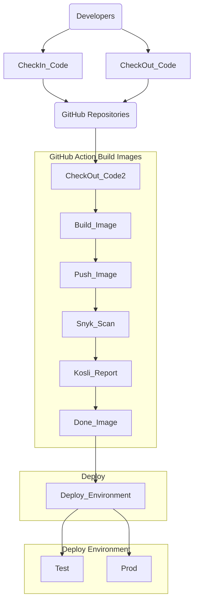

```mermaid
flowchart TD
    Developer("Developers")
        Developer --> CheckIn_Code
        Developer --> CheckOut_Code
        CheckIn_Code --> Repo
        CheckOut_Code --> Repo
    Repo("GitHub Repositories")
        Repo --> CheckOut_Code2

    subgraph "GitHub Action Build Images"
    CheckOut_Code2 --> Build_Image
    Build_Image --> Push_Image
    Push_Image --> Snyk_Scan
    Snyk_Scan --> Kosli_Report
    Kosli_Report --> Done_Image
    end
    subgraph "Deploy"
        Done_Image --> Deploy_Environment
    end    
    subgraph "Deploy Environment"
        Deploy_Environment --> Test
        Deploy_Environment --> Prod
    end

```
